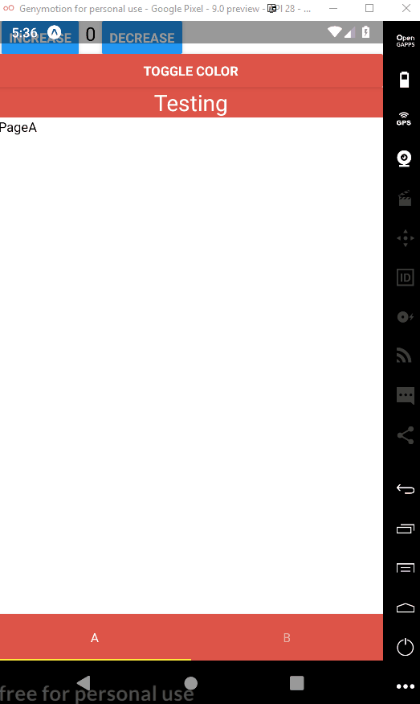

# Change Theme

PoC: Change theme by changing tabs, using React Navigation and Redux

## Gif Example

## Useful Links

* [https://medium.freecodecamp.org/managing-state-in-a-react-navigation-app-with-redux-6d0b680fb595](https://medium.freecodecamp.org/managing-state-in-a-react-navigation-app-with-redux-6d0b680fb595)

* [https://blog.producthunt.com/product-hunt-mobile-theme-with-redux-in-react-native-5d49f70ffdf2](https://blog.producthunt.com/product-hunt-mobile-theme-with-redux-in-react-native-5d49f70ffdf2)

* [https://stackoverflow.com/questions/52168546/import-a-created-redux-store-to-dispatch-an-action-from-a-non-connected-componen](https://stackoverflow.com/questions/52168546/import-a-created-redux-store-to-dispatch-an-action-from-a-non-connected-componen)